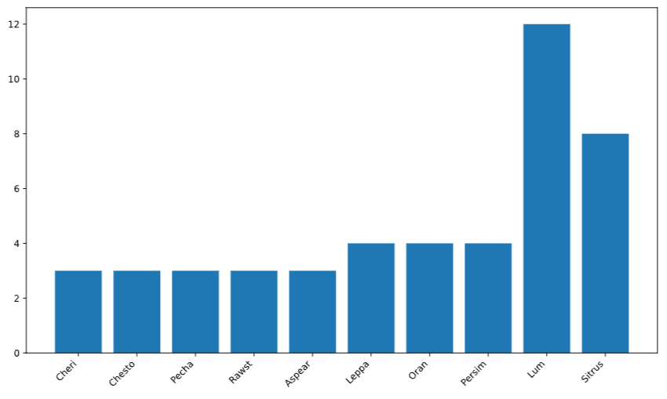

# 🍓 Berry Stats API

A FastAPI application that retrieves berry statistics from the public [PokeAPI](https://pokeapi.co/).

This API exposes an endpoint that gathers berry data and presents it in a human-readable JSON format. The number of berries retrieved can be controlled using a query parameter.

---

# 🚀 Features

- Fetch berry data from PokeAPI
- Configurable `limit` query parameter (1–100)
- Human-readable structured JSON response
- Asynchronous HTTP requests using `httpx`
- Automatic interactive API documentation (Swagger & ReDoc)
- Automated environment setup using `SETUP_ENV.bash`

---

# 📦 Requirements

Before running this project, make sure you have:

- **Python 3.12** (required)
- Git
- A Bash-compatible terminal (Linux/macOS or WSL on Windows)

Verify that Python 3.12 is installed:

```bash
python --version
```

If Python 3.12 is not installed, please install it before proceeding.

---

# ⚙️ Setup Instructions

Follow the steps below to download and configure the project locally.

---

## 1️⃣ Clone the Repository

```bash
git clone git@github.com:matsaldev/berry-stats-api.git
cd berry_stats_api
```

---

## 2️⃣ Set Up the Environment (Required Step)

The project includes an automated setup script to configure the environment using **Python 3.12**.

### Execute the setup script

```bash
chmod +x SETUP_ENV.bash && ./SETUP_ENV.bash
```

---

## ✅ What the Setup Script Does

The `SETUP_ENV.bash` script automatically:

- ✅ Verifies that **Python 3.12** is installed
- ✅ Creates a virtual environment (`venv/`) using Python 3.12
- ✅ Activates the virtual environment
- ✅ Upgrades `pip`
- ✅ Installs all required dependencies from `requirements.txt`

After running the script, your environment will be fully configured and ready to run the application.

---

### Add the Environment Variable (Manual):

### PyCharm

```
Run → Edit Configurations → Environment Variables
```

Add:

```
POKEAPI_BASE_URL=https://pokeapi.co/api/v2
```

---

### VS Code (`launch.json`)

```json
"env": {
  "POKEAPI_BASE_URL": "https://pokeapi.co/api/v2"
}
```

---

# ▶️ Running the Application

If your virtual environment is not currently active, activate it manually:

```bash
source venv/bin/activate
```

Start the FastAPI application using Uvicorn:

```bash
uvicorn app.main:app --reload
```

The API will be available at:

```
http://127.0.0.1:8000
```

---

# 📖 API Documentation

FastAPI automatically generates interactive API documentation.

- ✅ Swagger UI:
  ```
  http://127.0.0.1:8000/docs
  ```

- ✅ ReDoc:
  ```
  http://127.0.0.1:8000/redoc
  ```

---

# 🔎 API Endpoints

---

## `GET /allBerryStats`

Retrieves aggregated statistical analysis based on the `growth_time` of berries.

### Query Parameters

| Parameter | Type | Description | Default |
|------------|------|-------------|----------|
| limit | int | Number of berries to analyze (1–100) | 10 |

---

### ✅ Example Request

```bash
curl "http://127.0.0.1:8000/allBerryStats?limit=5"
```

---

### ✅ Example Response

```json
{
  "berries_names": [
    "Cheri",
    "Chesto",
    "Pecha",
    "Rawst",
    "Aspear"
  ],
  "min_growth_time": 2,
  "median_growth_time": 3,
  "max_growth_time": 6,
  "variance_growth_time": 2.67,
  "mean_growth_time": 3.67,
  "frequency_growth_time": {
    "2": 1,
    "3": 2,
    "6": 2
  }
}
```

---

## `GET /allBerryStats/graph`

Retrieves a histogram visualization of the `growth_time` frequency distribution of berries.

### Query Parameters

| Parameter | Type | Description | Default |
|------------|------|-------------|----------|
| limit | int  | Number of berries to analyze (1–100) | 10 |
| bins  | int  | Number of bins for the histogram (1 or greater) | 5 |

---

### ✅ Example Request

```bash
curl "http://127.0.0.1:8000/allBerryStats/graph?limit=5&bins=3"
```

---

### ✅ Example Response

Below is an example histogram visualization generated from the /allBerryStats/graph endpoint response.
The x-axis represents the growth_time ranges (bins),
and the y-axis represents the frequency (number of berries) in each range:



---

# 🛠 Tech Stack

- Python **3.12**
- FastAPI
- httpx
- Uvicorn

---

# 📌 Notes

- This project specifically requires **Python 3.12**.
- The `limit` parameter is restricted between 1 and 100 to prevent excessive API calls.
- Each berry requires an additional request to retrieve detailed statistics from PokeAPI.
- Performance can be improved using `asyncio.gather()` for concurrent external API requests.
- For production deployment, consider using Gunicorn with Uvicorn workers.

---

Happy coding! 🚀
